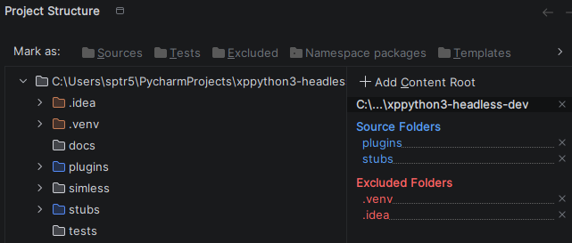

# 📘 xppython3-headless-dev
### Multi‑Plugin Workspace • Sim‑less Execution • Unified FakeXP API • Deterministic Headless Runner

A clean, scalable development environment for building multiple XPPython3 plugins **without launching X‑Plane**.

This workspace provides:

• A real X‑Plane‑compatible plugin folder structure  
• A unified FakeXP API surface that mirrors xp.*  
• A standalone FakeXPRunner that simulates the full plugin lifecycle  
• Deterministic 60 Hz execution in headless or GUI mode  
• A complete XPWidget + XPLMGraphics emulation layer (DearPyGui‑backed)  
• Auto‑creating, registered, and managed DataRefs  
• A multi‑plugin environment for integration testing  

The goal is **fast, maintainable plugin development** with behavior identical inside and outside X‑Plane.

---

# 📦 Requirements

Runtime dependencies are intentionally minimal:

• python 3.12+  
• dearpygui (only required when GUI mode is enabled)

All dependencies are declared in pyproject.toml.

---

# 📁 Directory Structure

```
xplane-python-dev/  
│  
├── plugins/  
│   ├── PI_ss_ota.py                     Example hardware plugin  
│   ├── dev_ota_gui.py                   Example XPWidget GUI plugin  
│   │  
│   ├── extlibs/                         Vendor modules, hardware drivers  
│   └── extensions/                      Shared plugin architecture  
│       ├── xp_interface.py              Protocol describing xp.* API  
│       └── datarefs.py                  DataRefSpec, TypedAccessor, Registry  
│  
├── simless/  
│   ├── run_ota_gui.py                   Example multi‑plugin runner  
│   │  
│   └── libs/  
│       ├── fake_xp.py                   FakeXP: public API surface  
│       ├── fake_xp_runner.py            FakeXPRunner: lifecycle + GUI + datarefs  
│       ├── fake_xp_widget.py            XPWidget emulation (DPG‑backed)  
│       ├── fake_xp_graphics.py          XPLMDisplay/XPLMGraphics emulation  
│       └── fake_xp_utilities.py         Misc XPLM utility shims  
│  
├── stubs/  
│   └── XPPython3/                       XPPython3 .pyi stub files  
│  
├── tests/                               Unit tests for FakeXP + runner  
│  
└── README.md
```

---

# 🧩 DataRef Model

FakeXP supports three interoperable dataref creation paths.

## 1. Managed DataRefs (recommended)

Defined using DataRefSpec and accessed via TypedAccessor.

Benefits:  
• Strong typing  
• Defaults for headless mode  
• Required/optional semantics  
• Clean error handling  

## 2. Registered DataRefs (explicit)

Created by FakeXPRunner during plugin load or manually.

## 3. Auto‑Created DataRefs (fallback)

If a plugin accesses a missing dataref:

• FakeXPRunner promotes the dummy handle  
• Type inferred from accessor  
• Default value assigned  
• Stored globally  

All plugins share a single global dataref table.

---

# 🧩 Using .pyi Stub Files

Place XPPython3 stubs in:

stubs/XPPython3/

Configure PyCharm:
1. Mark stubs/ as Excluded  
2. Add as Content Root  
3. Mark stubs/XPPython3 as Sources  



Enables:
• xp.* autocomplete  
• mypy type checking  
• fast indexing (prevents periodic freezes) 

---

# ▶️ Minimal Sim‑less Runner

A simple runner script is all that’s needed to execute plugins outside X‑Plane.

```python
from simless.libs.fake_xp import FakeXP  
from simless.libs.fake_xp_runner import FakeXPRunner  
import XPPython3

xp = FakeXP(debug=True)  
runner = FakeXPRunner(xp, enable_gui=True, run_time=5.0)

XPPython3.xp = xp

runner.load_plugin("plugins.PI_ss_ota")  
runner.load_plugin("plugins.dev_ota_gui")

runner.run_plugin_lifecycle()
```

This runner:

• Boots FakeXP  
• Replaces the real X‑Plane xp module  
• Loads any number of plugins  
• Executes the full lifecycle (start/enable/flight_loop/disable/stop)   
• Runs in GUI or headless mode  

For details on GUI behavior, see GUI_EMULATION.md.

---

# 🚀 Deployment to X‑Plane

Copy contents of plugin folder into:

X‑Plane 12/Resources/plugins/PythonPlugins/

Example:

    PI_ss_ota.py  
    extensions/  
    extlibs/  
