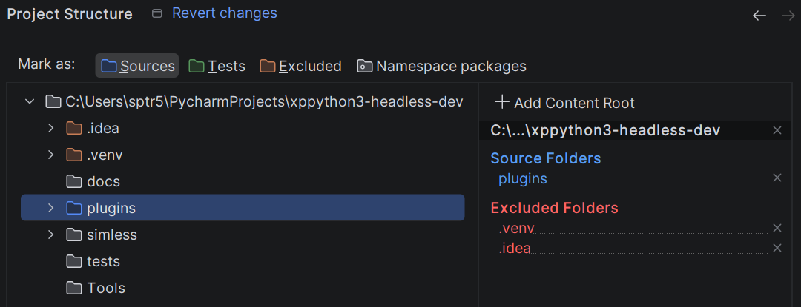

# PyCharm Configuration Guide
This project mirrors X‑Plane’s plugin environment while supporting full sim‑less execution.  
PyCharm must treat the **project root (`xplane-python-dev/`)** as the execution root for all headless scripts.

The following configuration ensures:
• correct imports for plugins and shared architecture  
• correct resolution of XPPython3 stubs  
• correct FakeXP behavior  
• identical import semantics in PyCharm, FakeXP, and X‑Plane  

---

## 1. Use the project root as the Working Directory
All sim‑less runners and plugin imports assume the project root is the working directory.
Do not open PyCharm inside `plugins/` or `simless/`.

---

## 2. Configure plugin path
XPPython treats the plugins directory as the import root.  
PyCharm must understand this behavior.

Right‑click: plugins/ → Mark Directory As → Sources Root

---

## Summary
Your project now has a unified import model:

| Environment         | Import Root      |
|---------------------|------------------|
| X‑Plane (XPPython3) | plugins          |
| PyCharm             | project, plugins |
| FakeXP headless     | symless          |
| Working directory   | project root     |

This guarantees:
• deterministic imports  
• correct type checking  
• correct stub resolution  
• identical behavior in sim‑less and production  
